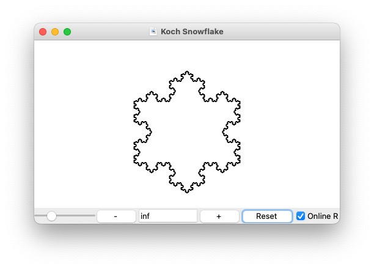
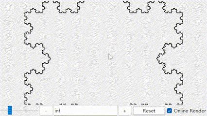
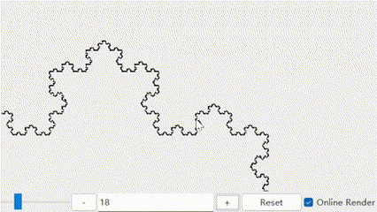
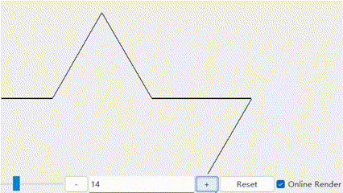
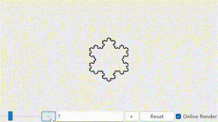
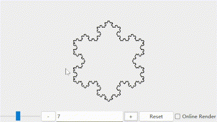
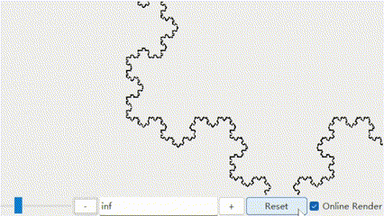
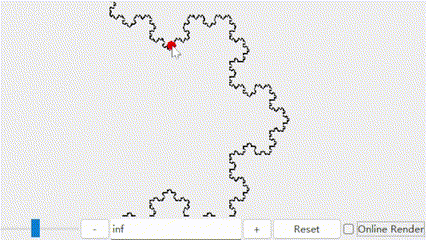

<div align="center">

# Etude03-Koch Snowflake Interactive


</div>

## Description

This is a project for **Etude 03 - Koch Snowflake Interactive** at the University of Otago COSC 326. I have implemented an application that can draw a Koch snowflake with any given order. 

You can scale the snowflake, drag it around, and change the order of the snowflake. 

## How to run

```bash
# clone project
git clone https://altitude.otago.ac.nz/rqian/cosc326-interactive-koch-snowflake.git
cd cosc326-koch-snowflake-interactive
```

### Run after Installation

Run the program by installing the package and running the `snowflake` command.

```bash
# install
pip install .  
# you can also use 'pip install -e .' to install in development mode
```

Now you can run the program by typing `snowflake` in the terminal.

```bash
snowflake
```
> Note: 
> 
> If it occurs an `CommandNotFoundException`, see [Python Scripts path](https://datatofish.com/add-python-to-windows-path/) for help.

Feel free to uninstall the package after you are done.

```bash
pip uninstall ruiyi-koch-snowflake
```

### Run without Installation

You can also run the program without installing the package. 

```bash
# make sure you are in the project directory
python main.py          # or python main.py --latest, this will run the latest version
python main.py --dev-0  # this will run the development version
python main.py --dev-1  # this will run the development version
```

## How to use

- Left click to drag the snowflake

<div align="center">



</div>

- Right click to scale the snowflake (drag right to scale up, drag left to scale down)

<div align="center">



</div>

- Use the '**+**' and '**-**' button to change the order of the snowflake

<div align="center">




</div>

- Use the '**Reset**' Button  to reset the snowflake

<div align="center">



</div>

- Drag the slider to change the resolution of the snowflake

<div align="center">



</div>

- Click the '**Online Render**' checkbox to render the snowflake online

<div align="center">



</div>

## Reference

- [COSC 326 - Etude 03 - Koch Snowflake Interactive](docs/kochsnowflakeInteractive.pdf)
- [Python Tkinter By Example](docs/Tkinter-By-Example.pdf)
- [Wikipedia](https://en.wikipedia.org/wiki/Koch_snowflake)
- [Convert .eps to .svg](https://cloudconvert.com/)
- [Turn Your Python Code Into a pip Package in Minutes](https://levelup.gitconnected.com/turn-your-python-code-into-a-pip-package-in-minutes-433ae669657f)

